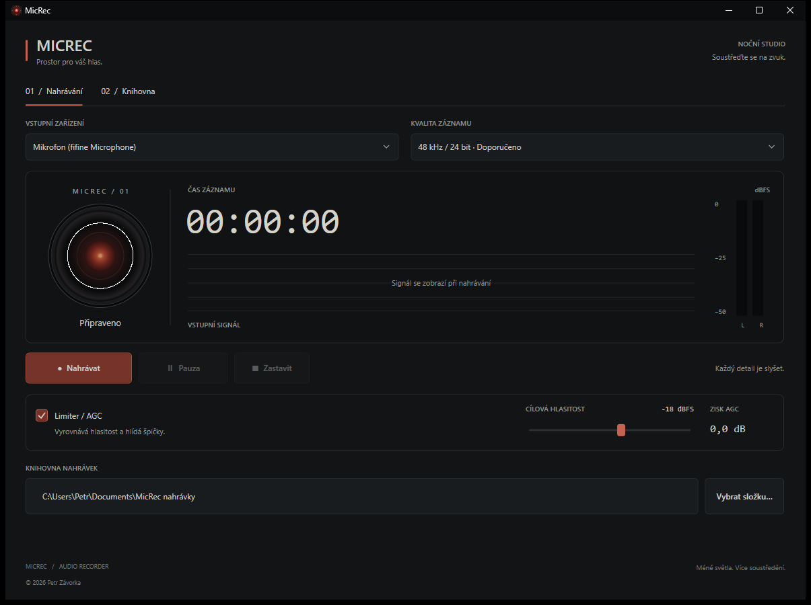

# MicRec



Windows aplikace (.NET 8 / WPF) pro nahrávání zvuku z mikrofonu.

## Funkce

- **Výběr mikrofonu** ze všech aktivních vstupních zařízení (WASAPI).
- **Živý ekvalizér** – 4 volitelné styly zobrazení signálu (sloupcový, kruhový, osciloskop,
  ručičkové VU), 20pásmová spektrální analýza (FFT) v reálném čase, plus samostatné
  úrovňové metry pro levý a pravý kanál (peak, barevně: zelená / žlutá / červená).
- **Pauza a pokračování** – nahrávání lze kdykoli pozastavit a pak navázat do stejného
  souboru; metry a ekvalizér běží dál i v pauze.
- **Limiter / AGC** – v reálném čase vyrovnává hlasitost směrem k nastavenému cíli
  (posuvník, výchozí −18 dBFS) a zároveň měkkým limiterem hlídá strop cca −1 dBFS, takže
  signál nikdy nezkliduje. Lze vypnout zaškrtávacím polem.
- **WAV výstup ve vysílací kvalitě** – na výběr:
  - 48 kHz / 24-bit PCM (doporučeno, výchozí)
  - 48 kHz / 16-bit PCM
  - 44,1 kHz / 16-bit PCM (CD kvalita)
- **Výstupní složka** – jde vybrat tlačítkem „Vybrat složku…“, výchozí je
  `Dokumenty\MicRec nahrávky`. Soubory se pojmenovávají
  `Nahravka_RRRR-MM-DD_HH-mm-ss.wav`.

## Spuštění

```bash
dotnet run --project "O:\MICREC\MicRec.csproj"
```

nebo přímo zkompilovaný .exe:

```
O:\MICREC\bin\Debug\net8.0-windows\MicRec.exe
```

Pro distribuční verzi bez nutnosti .NET runtime na cílovém PC:

```bash
dotnet publish -c Release -r win-x64 --self-contained true -p:PublishSingleFile=true
```

Výsledný `MicRec.exe` bude v `bin\Release\net8.0-windows\win-x64\publish`.

## Poznámky k limiteru

Jde o kombinaci automatického zesílení (AGC), které tichý/hlasitý hlas postupně
narovnává k cílové hlasitosti, a měkkého limiteru, který brání překmitu (klipování)
i při náhlém hlasitém zvuku. Zisk, který AGC aktuálně přidává/ubírá, je vidět v poli
„Aktuální zisk AGC“.

## Noční studio: přehrávání a výběr nahrávek

Aktuální samostatnou aplikaci spustíte pomocí `O:\MICREC\MicRec.exe`.

- Po spuštění nahrávky se v knihovně zobrazí její skutečná zvuková vlna (samostatně L/R, případně mono), časová stupnice a ukazatel přehrávání.
- Kliknutí nebo tažení po vlně přesune přehrávání na zvolené místo. Při pauze zůstane přehrávání pozastavené. Na aktivní časové ose fungují šipky (5 s), Ctrl + šipky (1 s) a Home/End.
- Přehrávání má vlastní pauzu, pokračování a stop. Vlna zůstává dostupná po zastavení i dohrání; načítá se na pozadí s omezenou spotřebou paměti.
- Oko HAL v nahrávání i přehrávači mění jas a velikost středu podle skutečné RMS hlasitosti. Reakce má plynulé doznívání, v pauze je střed jantarový.
- Ctrl + kliknutí vybírá jednotlivé nahrávky; Shift + kliknutí vybírá rozsah. Přesun, převod a mazání v kontextové nabídce pracují s celým výběrem. Mazání zobrazí potvrzení s počtem souborů. Přejmenování je dostupné pro jeden soubor.
- Tlačítka přehrávání mají samostatný rozměr 28 × 28 px, aby je neořezávalo odsazení buněk.
- **Převod formátu** – z kontextové nabídky nahrávky lze převést na MP3 (128/192/320 kb/s) nebo WMA; převedený soubor se objeví přímo v knihovně vedle originálu.
